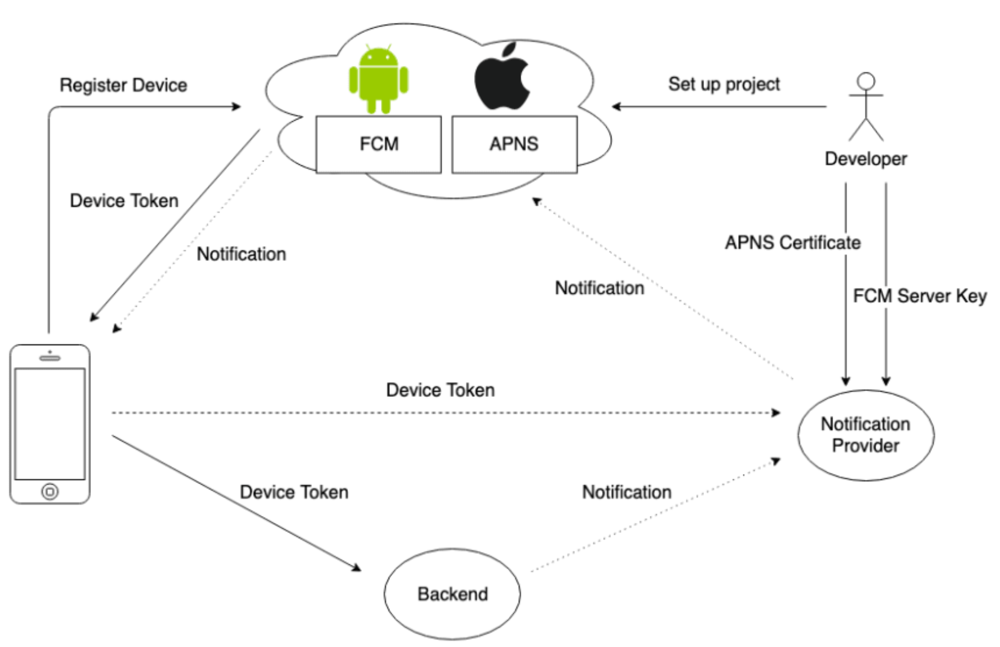
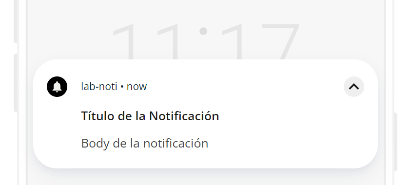

# Laboratorio: Notificaciones

Con el fin de poner en práctica lo visto en el uso de notificaciones como backend asíncrono, en este laboratorio se implementará un sistema basado en notificaciones, el cual permite generar imágenes de manera automática (tarea costosa en tiempo y cómputo), y compartir el resultado a través de notificaciones push.

## Marco Teórico

Las notificaciones push son mensajes que se envían desde un servidor a una aplicación cliente, y que aparecen en la pantalla del dispositivo móvil del usuario, incluso cuando la aplicación no está en primer plano. Estas notificaciones pueden ser informativas, promocionales, de recordatorio, entre otras, como por ejemplo, las notificaciones de Whatsapp, Instagram, Uber, etc.

Los 2 grandes servicios de notificaciones push son Firebase Cloud Messaging (FCM) y Apple Push Notification Service (APNs), quienes tienen el control sobre las notificaciones dado su integración directa como principales mantenedores de los sistemas que las reciben. Estos a su vez, otorgan el permiso de utilizar sus APIs de envío de notificaciones a empresas de terceros, como OneSignal, Pusher, entre otros, para que estos últimos brinden a los usuarios paquetes de notificaciones para ser enviadas (ver arquitectura).



Antes de enviar una notificación, se debe tener en cuenta que el usuario debe haber dado permiso a la aplicación para recibir notificaciones, y que el dispositivo debe estar conectado a internet. Además, se debe tener en cuenta que las notificaciones push no son mensajes instantáneos, por lo que pueden tardar en llegar al dispositivo del usuario. A nivel de aplicación, necesitamos obtener el token del dispositivo, el cual es único para cada dispositivo y por lo general se obtiene al abrir por primera vez la aplicación.

Este token permite indicar que la notificación push que enviaremos llegue precisamente al dispositivo al que queremos notificar, y por comodidad, podemos almacenar este token en la base de datos de nuestro sistema backend, de modo tal que esté asociado a nuestro usuario, y entonces saber qué dispositivo está asociado a su cuenta y enviarle la notificación. Notar que esto tiene ciertos problemas, puesto que si se usan 2 cuentas en un mismo dispositivo, o 1 cuenta en 2 dispositivos distintos, se deberá tener un manejo especial de los tokens.

### Descripción del Código

A continuación, se presenta un backend y frontend para el laboratorio, siendo el primero en ruby con Sinatra y el otro en javascript con expo go. El backend se encarga de gestionar la autentificación, generación de imágenes y publicación de tokens, mientras que el frontend se encarga de realizar solicitudes al backend, y reaccionar a los eventos gatillados por las respuestas y notificaciones que recibe.

### Backend

Para el manejo de tokens de autentificación, el backend dispone de los endpoints `/login` y `/register`, los cuales permiten autentificar y registrar al usuario siguiendo implementaciones vistas en otros laboratorios.

En el caso de la generación de imágenes, esta se lleva a cabo a través de `Jobs`. Un job viene siendo una tarea que, por lo general, se ejecuta en segundo plano y cuando termina, este informa a quién lo invocó y luego deja de existir. Se suelen utilizar para distribuir la carga de tareas que comprenden un tiempo considerable de cómputo, como por ejemplo, la generación de imágenes. En este caso, el job se encarga de generar una imagen de un color aleatorio, y luego la guarda en el sistema de archivos expuesto del backend (es decir, queda en una url accesible desde internet para poder descargarla). Una vez terminado este proceso, el job envía una notificación push al cliente que la solicitó. Se puede revisar la lógica de jobs para imágenes en `/app/jobs/image_job.rb`.

```ruby
  # Lógica de creación de imagen [...]

  #Envío de la notificación push
  PushNotificationService.send_notification(
    to: push_token,
    title: "Imagen generada para #{name}",
    body: "La imagen personalizada ha sido generada.",
    data: { imageUrl: "http://192.168.1.32:3000/images/#{output_image_name}" }
  )
```

Notar que esta notificación cuenta con un título y un body, los cuales se verán en el celular uno encima del otro. El contenido de data es un objeto que se puede enviar junto con la notificación, y que puede ser utilizado por la aplicación cliente para realizar alguna acción. En este caso, se envía la url de la imagen generada, de modo tal que el cliente pueda descargarla, sin intervenir en el diseño de la notificación (la que por cierto, pueden ir probando aquí https://onesignal.com/notification-preview).



El endpoint para generar imágenes es `/images`, y funciona a través del verbo POST, mientras que el endpoint para compartir una imagen, a través de notificaciones push a todos los usuarios que se han registrado en la plataforma, es `/images/:id/share`, también con el verbo http POST, pero incluyuendo en la url la id del usuario que está compartiendo, para que no le llegue una notificación a si mismo.

```ruby
def share
    user_id_to_exclude = params[:id]
    user = User.find_by(id: user_id_to_exclude)

    if user.nil?
      render json: { error: "Usuario no encontrado." }, status: :not_found
      return
    end

    users_to_notify = User.where.not(id: user_id_to_exclude).where.not(push_token: nil)
    users_to_notify.each do |recipient|
      PushNotificationService.send_notification(
        to: recipient.push_token,
        title: "El usuario #{user.username} compartió su foto contigo",
        body: "El usuario #{user.username} ha compartido su foto.",
        data: { image_url: "http://192.168.1.32:3000/images/output_#{user.username}.jpg" }
      )
    end

    render json: { message: "Notificación enviada a los usuarios." }, status: :ok
  end
```

### Frontend

Con el uso de la librería expo-notifications, el frontend es una aplicación capaz de recibir notificaciones push, y reaccionar a ellas. A su vez, con el fin de generarlas, realiza peticiones HTTP al backend utilizando sus tendpoints. En este caso, se cuenta con una pantalla de login, una de registro, y una de generación de imágenes, esta última permite no sólo generar imágenes, si no también compartirlas y visualizarlas en caso de haber presionado una notificación push.

La aplicación utiliza enrutamiento basado en archivos, y almacena el id del usuario en SecureStorage, el cual mantiene de forma segura la infromación en una memoria no volátil del dispositivo. Este SecureStorage es accesible desde cualquier parte de la aplicación, y que se puede utilizar para almacenar información sensible, como tokens de autentificación, entre otros. Si el id del usuario no está en SecureStorage, la aplicación redirige al usuario a la pantalla de login, caso contrario, se le envía a la vista para generar y/o ver imágenes.

Además, se implementaron 2 utilidades, `Storage.js` que abstrae el manejo de datos en el SecureStorage, y `Notifications.js`, que abstrae el proceso de suscripción a notificaciones push, en conjunto con la obtención del token del dispositivo. Una particularidad bastante interesante, es que al no haber SecureStorage en la web, la aplicación valida en qué tipo de dispositivo se encuentra, para cambiar a AsyncStorage en caso de ser web.

Notar que la vista `[user_id]`, que corresponde a una ruta dinámica que recibe el id del usuario como parámetro de enrutamiento, carga en el inicio de su ciclo de vida (al montarse) un listener para recibir notificaciones (`receivedListener`), y un listener para manejar la apertura de la notificación (`responseListener`). El primero se encarga de mostrar un mensaje en pantalla cuando se recibe una notificación, y el segundo de redirigir al usuario a la vista de imágenes cuando se presiona la notificación.

```javascript
useEffect(() => {
  const receivedListener = Notifications.addNotificationReceivedListener(
    async (notification) => {
      const { title, body, data } = notification.request.content;
      const imageUrl = data.imageUrl;

      if (title?.includes('Imagen generada para')) {
        setItem('imageUrl', imageUrl);
        setImageUrl(imageUrl);
      }
    }
  );

  const responseListener =
    Notifications.addNotificationResponseReceivedListener((response) => {
      const { data } = response.notification.request.content;
      if (data?.image_url) {
        Linking.openURL(data.image_url);
      }
    });

  return () => {
    Notifications.removeNotificationSubscription(receivedListener);
    Notifications.removeNotificationSubscription(responseListener);
  };
}, []);
```

Cuando el componente se desmonta, se eliminan estos listeners, de modo tal que no se queden escuchando notificaciones cuando el usuario no está en la vista de imágenes.

El resto de la aplicación es el uso de conceptos de React Native y Expo visto en clases anteriores, ya con el entendimiento de cómo funcionan las notificaciones push y cómo se pueden utilizar en una aplicación móvil, es posible avanzar hacia el próximo desafío.

## Desafío

Ya que contamos con una base de datos que registra el token del dispositivo de cada usuario (`push_token`), y que actualmente la aplicación sólo es capaz de compartir una imagen a todos los usuarios, se propone implementar una funcionalidad de búsqueda de usuarios, la cual liste los usuarios que calcen con algún criterio de búsqueda (username por ejemplo), y ofrezca un botón para enviar una notificación push que les llegue directamente, sin tener que publicar la notificación para todo el mundo.

Para esto, será necesario añadir nuevos endpoints al backend, tanto para la búsqueda como para el envío de notificaciones directas. Por el lado del frontend, se sugiere añadir una nueva vista para no sobrecargar la vista de imágenes, y que permita realizar la búsqueda y enviar notificaciones a los usuarios encontrados, utlizando una FlatList y algún componente que permita mostrar texto al lado de un botón de forma ordenada.